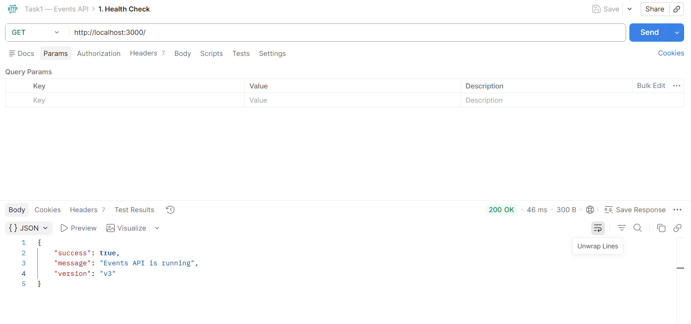
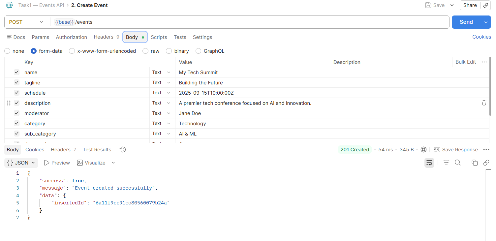
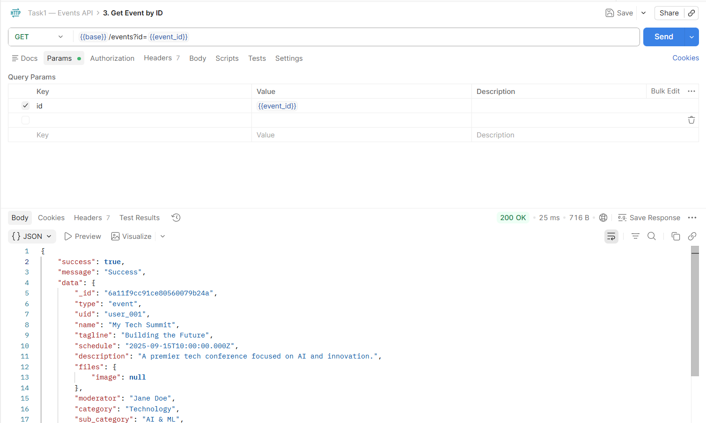
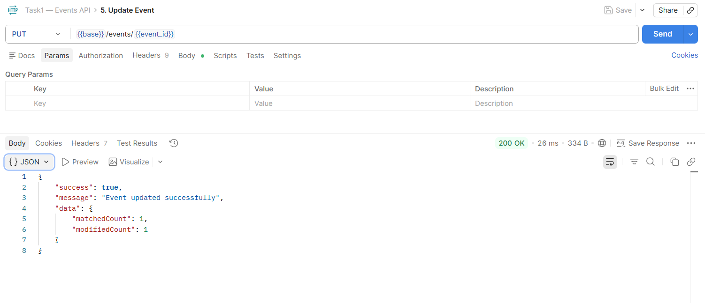
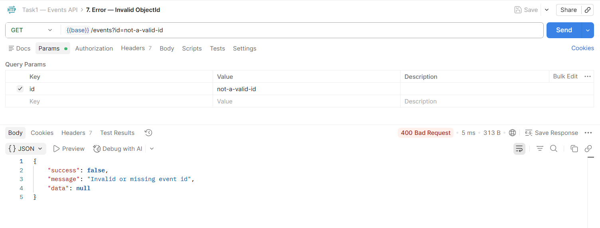

# My Internship Tasks

Hey! This repo has the code and docs for my two internship tasks. 

## Task 1: Events API

This is a backend REST API I built using Node.js and Express to manage events. It connects to MongoDB using the native driver instead of Mongoose, which was new for me. I also set up Multer so it can handle image uploads.

**Stack I used:**
- Node.js and Express
- MongoDB (raw driver, no mongoose stuff)
- Multer for the images
- dotenv to manage secrets

**Project layout:**
```text
task1/
├── src/
│   ├── index.js
│   ├── db.js 
│   ├── upload.js
│   ├── routes/
│   │   └── events.js
│   └── controllers/
│       └── eventController.js
├── uploads/
├── .env.example
└── package.json
```

### How to run it

First open a terminal and go to the task1 folder:
`cd task1`

Run `npm install` to get the dependencies.

Next, copy `.env.example` to `.env` and put in your MongoDB URI. Make sure you actually have MongoDB running on your machine or it will throw an error.

Then just start the server:
`node src/index.js`

### My Endpoints

| Method | Endpoint | Description |
|--------|----------|-------------|
| GET | `/api/v3/app/events?id=:event_id` | gets one event by its mongo id |
| GET | `/api/v3/app/events?type=latest&limit=5&page=1` | lists out the newest events with pages |
| POST | `/api/v3/app/events` | makes a new event, send form-data here |
| PUT | `/api/v3/app/events/:id` | edits an event, only send the fields you want to change |
| DELETE | `/api/v3/app/events/:id` | deletes an event |

### Postman Testing

I tested all 5 endpoints in Postman to make sure they work right. Screenshots below!









## Task 2: Nudge API Docs

For this task I had to look at a wireframe image and figure out how the API should be structured to make it work. I planned out the endpoints and what the database objects should look like before writing any actual code.

> 📄 You can see all my api documentation over here: [task2/README.md](./task2/README.md)

---
*Note: This was my first time using MongoDB without Mongoose. It took a bit to get used to doing things manually, but it makes a lot of sense once you understand how ObjectId works!*

Your Name | Internship Assignment
# DT-Backend-Challenges
